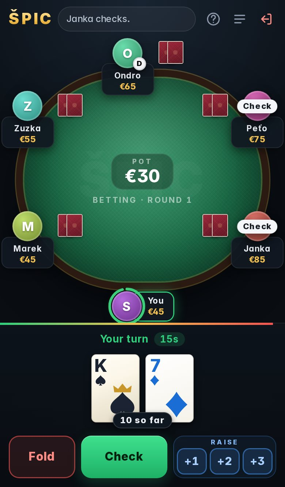
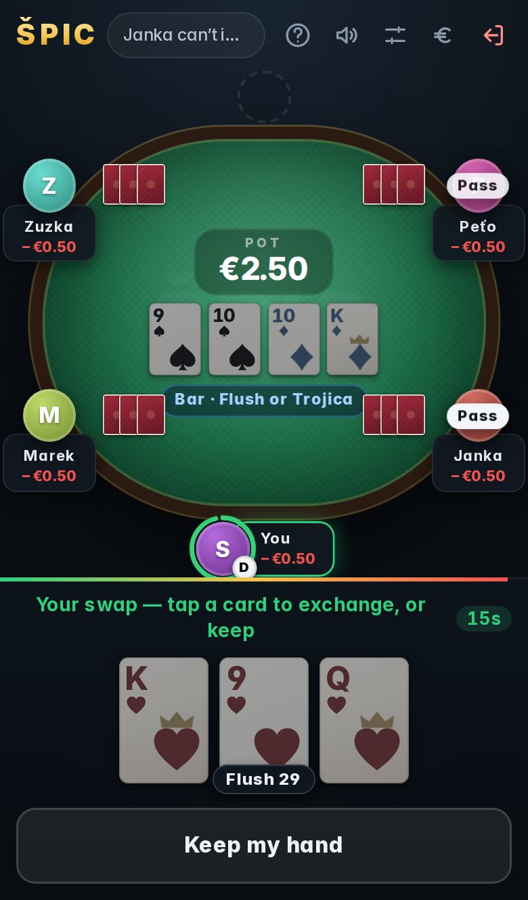
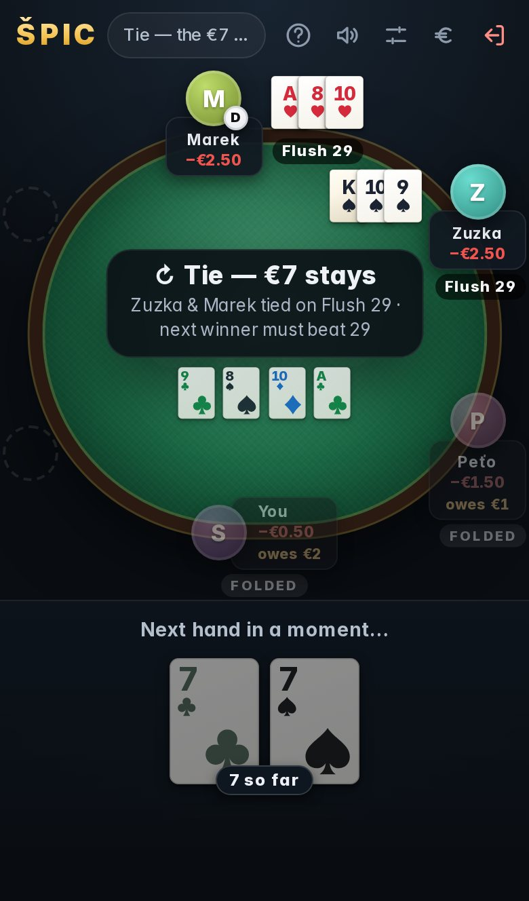
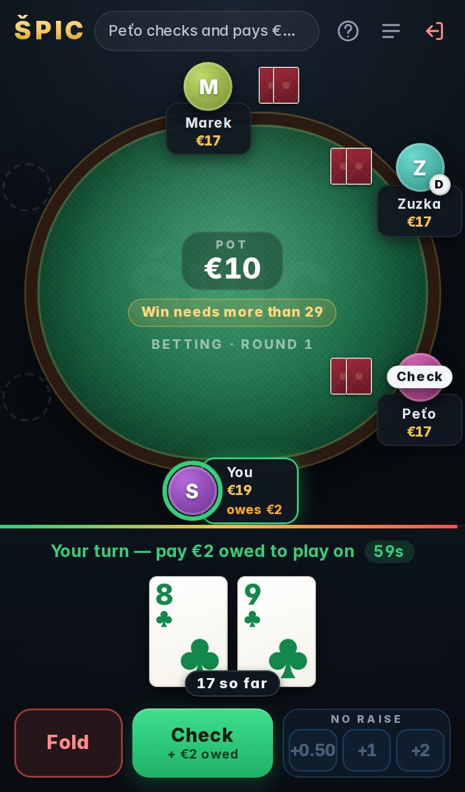
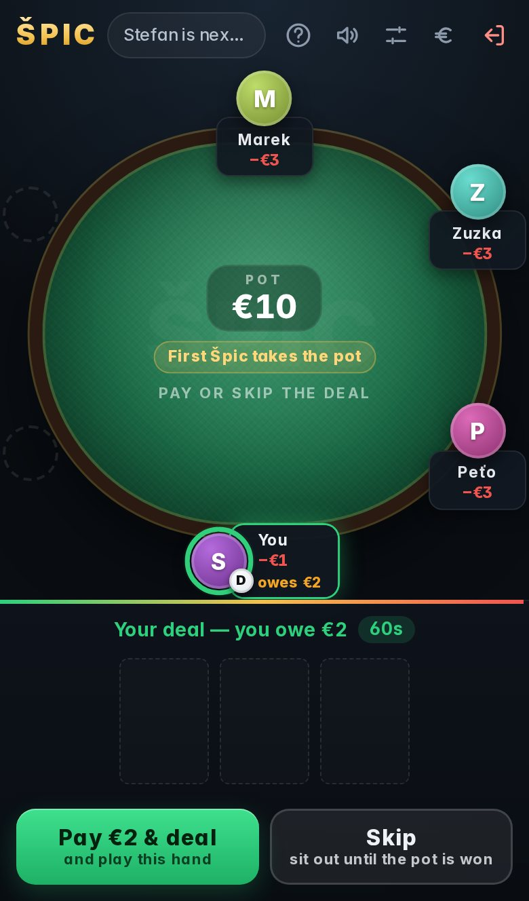
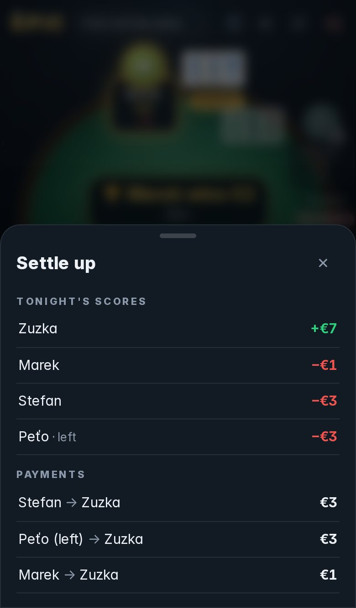
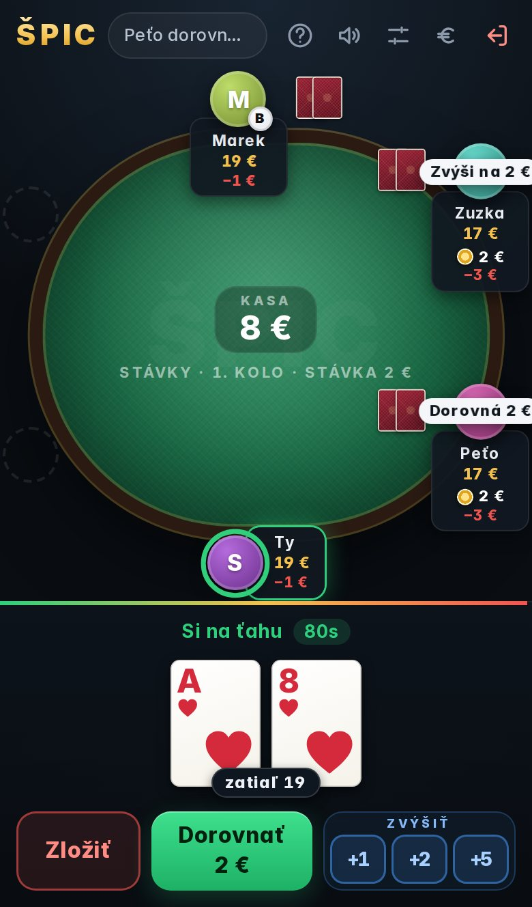
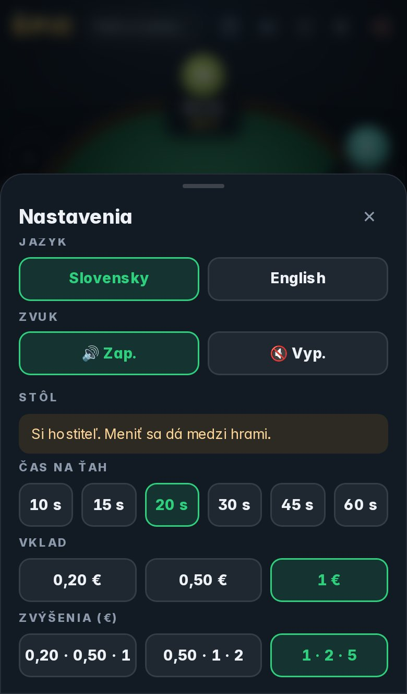
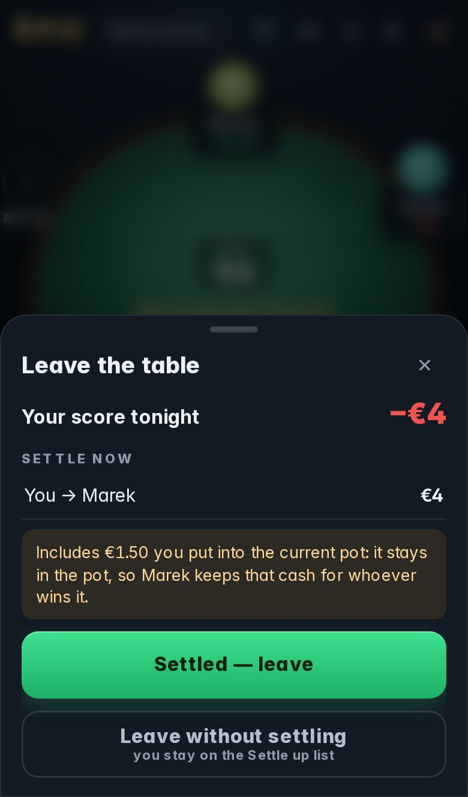
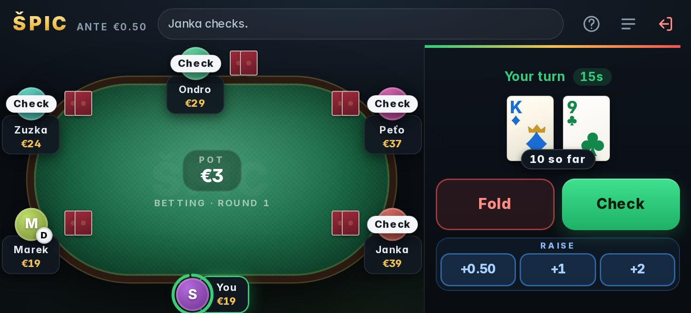

# ŠPIC — Bar Card Game

ŠPIC is a real-time, multiplayer card game inspired by the Slovak bar game *Špic*. Up to six players sit at a shared table on their phones, build the strongest three-card hand they can, and try to take the pot. The client is built with React and Vite; the Node.js server runs the game and synchronizes players with Socket.IO.

<p align="center">
  
  
  
</p>
<p align="center">
  
  
  
</p>
<p align="center">
  
  
  
</p>
<p align="center">
  
</p>

## Features

- Six-seat table built for phones first: you always sit at the bottom, with your hand and big thumb-sized buttons in the dock below the table
- Portrait, landscape and desktop layouts
- Crisp vector cards with a four-colour deck (♠ black, ♥ red, ♦ blue, ♣ green), so suits are easy to tell apart on a small screen
- Talon swaps show which table cards reach the bar and the score you'd end up with, then ask you to confirm
- Countdown ring on the active player, vibration, a chime and a tab-title alert when it's your turn
- Table sounds made in the browser (deal, chips, swap, win, tie), with a mute button in the top bar
- Slovak and English: picks your phone's language and can be switched under ⚙, per phone
- Reconnects without losing your seat: reload the page, switch apps or change networks mid-hand and you keep your seat, score and cards
- The screen stays awake while you're seated, and the game can be added to your home screen as an app
- Pub stakes: €0.50 ante and raises of €0.50 / €1 / €2 by default
- **Host settings:** the first player to sit down hosts the table and can change the turn timer (10–60 s), ante (€0.20 / €0.50 / €1) and raise steps between hands
- No buy-in: everyone sits down at €0 and plays on credit, with a running score on every seat (+/−)
- **Leaving early:** settle with the table in one tap and the others play on
- Running score on every seat (+/−) and a **Settle up** screen that turns the evening into the fewest possible payments
- The carried-over pot is tracked for you: who owes what to play on, and who has to beat which score
- Docker and Docker Compose deployment

## How to play

1. Open the game and tap an empty **Sit** seat and enter your name. You start at €0.
2. When at least two players are seated, anyone at the table can tap **Deal cards**. Each player antes €0.50 and receives two cards.
3. **First betting round.** Starting left of the banker (marked **D**), players check, call or fold. Only the **first player** (left of the banker) and the **last player** (right of the banker) may raise, by €0.50, €1 or €2. There is at most one raise and one re-raise per round. The banker never folds and calls everything automatically, playing blind.
4. Each player still in the hand receives a third card, followed by a second betting round with the same rules.
5. The server reveals a four-card talon. Starting left of the banker, each player may replace one card with a talon card. The new hand must at least match the bar, which is the best hand swapped in so far (matching it makes a tie); otherwise the player passes. If the talon holds a Flush or Trojica and the banker never looked at their cards, the banker may take it instead. **Look at cards** reveals the banker's hand to them but gives up this option (they still call everything).
6. At showdown the best hand wins the pot. You need a Flush or Trojica to take it — even when everyone else folded.

Tap **?** in the top bar for the rules, the ticker for the table log, and ⚙ for language, sound and table settings.

### Host and table settings

The first player to sit down is the **host**. If they leave, the player who has been seated longest takes over. Under ⚙ the host can change the turn timer, the ante and the raise steps. Changes are allowed only between hands, and everyone sees them in the table log. Everyone else can see the current settings there. Language and sound are per phone and anyone can change them.

### When the pot stays

- **Ties:** if the best hands tie, the pot stays and the next winner must beat the tied score (a tie at 29 needs 30 or more). Two Špics in one hand are a tie too; after a tie on Špic, the **first Špic** in turn order takes the pot.
- **Playing on for a carried pot:** everyone who didn't play the hand to the end owes what the finishers put in (beyond the ante), minus what they paid themselves. Players who were not at the table owe the full amount, and debts from several carried hands add up. You pay it at your first decision of the next hand (the buttons show "+ €X owed"), or fold and keep owing.
- **A banker who owes:** before the deal they choose **Pay & deal** or **Skip**. Skipping means sitting out until the pot is won, and the deal passes to the next player who owes nothing.
- When someone finally wins the pot, all debts are cleared and everyone is back in.

### Scores and settling up

- There is no buy-in and nobody runs out of chips. Everyone sits down at €0 and plays on credit: antes, calls and raises lower your score, and winning a pot raises it.
- Each seat shows its **running score** for the evening (+/−).
- **Settle up** (the € button) lists everyone's score, including players who already left, and the payments that square everything up (biggest loser pays the biggest winner first). Settle once the pot has been won.
- **Leaving early:** tap the leave button. It shows your score and who to pay (or who pays you) so the players who stay can go on. Pay, tap **Settled — leave**, and you're off the books. You can also **leave without settling**: then you stay on the Settle up list as "left".
- **Leaving during a carried pot:** you settle what you won or lost *before* that pot. Your money in the pot is lost and stays in the pot: you hand it to the host, who keeps the cash for whoever wins the pot.
- If a phone drops out for good (removed after 5 minutes offline), that player also stays on the Settle up list as "left".
- Scores live in the server's memory: restarting or updating the container resets them, so settle up first.

### Hand scoring

Hands are scored from three cards (A = 11, K/Q/J/10 = 10, 9/8/7 = face value):

- **Zlatý špic:** three aces, scored as 33.
- **Špic (31):** a flush totaling 31 points.
- **Trojica:** three cards of the same rank, scored as 30.5; higher triples win ties.
- **Flush:** three cards of the same suit; the score is the sum of their card values.
- **Bicykel:** three different suits with no pair. This dead hand cannot be improved with a single swap and folds automatically.

### Timers and connections

- The turn clock is 15 seconds by default (the host can change it). If a player runs out of time, the server checks when that is free and folds otherwise (it never spends money for you), passes during the swap phase, and skips the deal for a banker who owes.
- The screen stays awake while you're seated. If a phone still drops its connection, the player keeps their seat for 5 minutes. While they are offline their turns run on a 5-second clock, and they are not dealt into new hands. If they don't come back, they are removed and fold any hand in progress.
- Players who sit down during a hand wait for the next deal.

## Run locally

Use Node.js 22 or a recent Node.js 20 release supported by Vite 7.

Install dependencies:

```bash
npm install --prefix server
npm install --prefix client
```

Start the server in one terminal:

```bash
npm --prefix server run dev
```

Start the client in another terminal:

```bash
npm --prefix client run dev
```

Open [http://localhost:5173](http://localhost:5173). The Vite client connects to the Socket.IO server on port `3001`. To try it on phones, open `http://<your-computer's-LAN-IP>:5173` from a phone on the same Wi‑Fi. Each browser tab gets its own player session, so you can also open several tabs to fill the table.

### Tests

The server has two test suites. The rule tests replay scripted hands with a stacked deck (ties and debts, a banker who pays or skips, Špic ties, raise limits, fold-outs, cash-outs, host settings). The simulation runs bot tables of 2–6 players over real sockets, with random raises, folds, swaps, timeouts, disconnects, reconnects, cash-outs and late joins. After every change of state it checks that money is conserved, no card is dealt twice, hidden cards stay hidden, only allowed players raise and a round can never stall:

```bash
npm --prefix server test
```

Client checks:

```bash
npm --prefix client run lint
npm --prefix client run build
```

## Run with Docker

From the repository root:

```bash
docker compose up --build
```

Then open [http://localhost:3001](http://localhost:3001), or `http://<server-IP>:3001` from phones on the same network. To stop the service, press `Ctrl+C` in the terminal running Compose.

The image compiles the client and server at build time and runs plain `node` with production dependencies only. It also exposes a `/healthz` endpoint for health checks.

## Project structure

```text
client/        React and Vite web client
  src/components/   Table, seats, cards, dock (hand + controls), sheets
  src/i18n.ts       Slovak and English texts (the server sends message keys)
  src/sounds.ts     Synthesized table sounds
server/        Express, Socket.IO, and game rules
  src/game/         GameManager (flow, timers, sessions), HandEvaluator, deck
  test/             Multi-player simulation test
Dockerfile
docker-compose.yml
```
